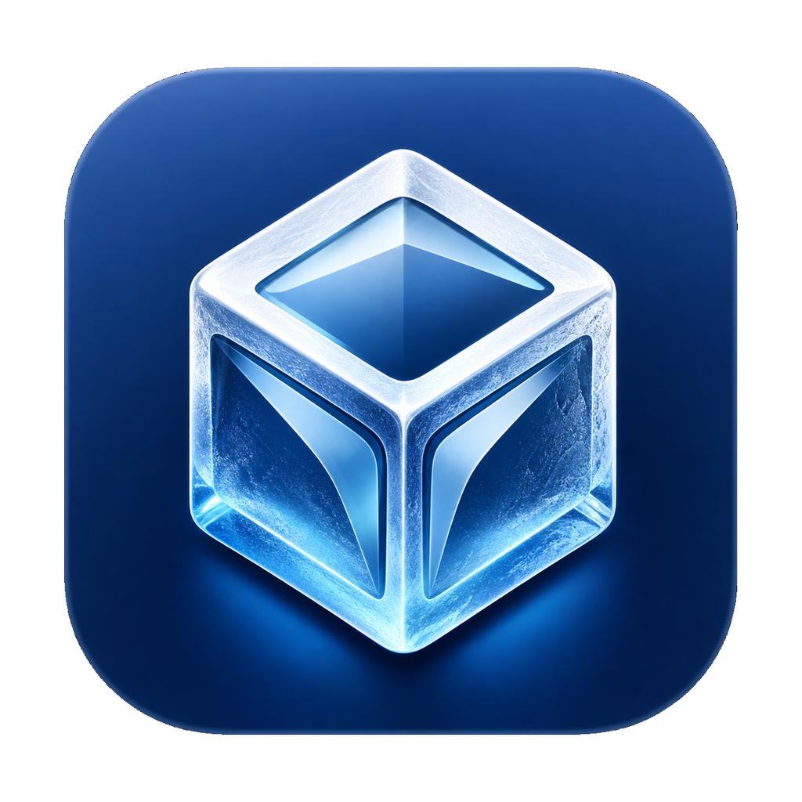

<p align="center">
  
</p>

<h1 align="center">Minimal Ice</h1>

<p align="center">
  A minimal, private macOS menu bar utility tuned for a clean local build.
</p>

<p align="center">
  
  
  
  
</p>

## Overview

Minimal Ice is a private personal-use fork of the original Ice macOS menu bar utility.
It keeps the core menu bar management experience and removes the parts that are
not needed for a local-only build: public distribution, automatic updates,
release feeds, funding links, support links, and public issue workflows.

The result is intentionally quiet: native macOS UI, a small settings surface,
and a codebase shaped around one local owner.

## Platform

| Component | Version |
| --- | --- |
| macOS SDK | 26.5 |
| Deployment target | macOS Tahoe 26.0 |
| Xcode | 26.5 |
| Swift compiler | 6.3 |
| Swift language mode | 6 |

Xcode 26.5 requires macOS Tahoe 26.2 or later to build. The project currently
targets macOS Tahoe 26.0 at runtime.

## Build

Open `Ice.xcodeproj` in Xcode and run the `Ice` scheme, or build from Terminal:

```sh
xcodebuild -project Ice.xcodeproj -scheme Ice -configuration Debug build
```

The project uses local ad hoc signing for personal builds. Minimal Ice requires
Accessibility permission for menu bar management. Normal operation should not
require Screen & System Audio Recording permission.

## Dependencies

- AXSwift
- CompactSlider
- LaunchAtLogin

Sparkle and the old update feed are intentionally not included.

## Repository Shape

This repository is app source plus local build context. The app source lives in
`MinimalIce/`, grouped by `App`, `Features`, `Infrastructure`, `Shared`, and
`Supporting` so Xcode and coding agents see the same map. The repository
intentionally does not include public GitHub issue templates, funding metadata,
release automation, or support flows.

## License

Minimal Ice remains available under the [GPL-3.0 license](LICENSE). The original
license and copyright notices are preserved because this is a derivative fork.
