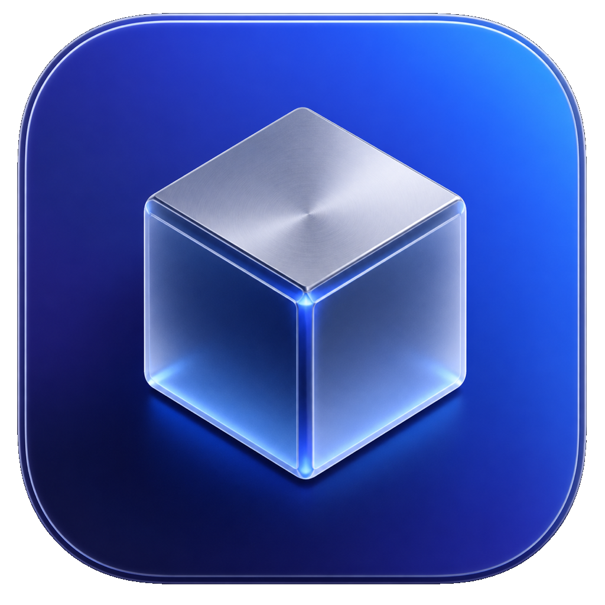

  

<h1 align="center">Minimal Ice</h1>

  A refined macOS menu bar utility for hiding what you do not need, until the
  moment you do.

  <a href="https://github.com/viasaud/Minimal-Ice/releases/latest">Download</a>
  ·
  <a href="LICENSE">License</a>

## Overview

Minimal Ice keeps your menu bar calm. Place extra menu bar items behind a small
chevron, reveal them instantly on hover or click, and keep the items you always
need visible.

It is native, lightweight, and private by design.

## Highlights

- Hide selected menu bar items behind a single chevron.
- Keep an always-visible area for essentials.
- Use an optional always-hidden area for items you rarely touch.
- Reveal hidden items on hover or click.
- Rearrange items with the familiar Command-drag gesture.
- Run locally with no accounts, analytics, ads, or cloud service.

## Setup

Download the latest release, open **Minimal Ice**, and grant Accessibility
permission when macOS asks. Minimal Ice needs Accessibility access to read and
rearrange menu bar items.

If macOS blocks the first launch, right-click **Minimal Ice.app** and choose
**Open**.

## Privacy

Minimal Ice works on your Mac. It does not collect analytics, track usage, show
ads, or require a network connection for normal menu bar management.

## License

Minimal Ice is available under the [GPL-3.0 license](LICENSE).
